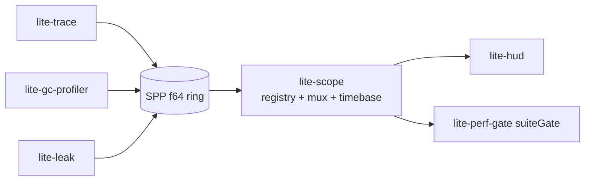

# @zakkster/lite-scope

Scope Probe Protocol (SPP v1): the registry, sinks, and timebase of the
@zakkster profiler suite. Zero-dependency single-file ESM. Zero-GC write
path: one record is four f64 slots, strings are interned at init, and the
entire probe-facing contract is a single monomorphic
`sink.write(packed, t, a, b)`.

Probes (lite-trace, lite-gc-profiler, lite-gpu-profiler, lite-leak, ...)
never import this package; they receive a sink by dependency injection and
speak the protocol. Consumers (lite-hud, lite-perf-gate, exporters) decode
using out-of-band registry metadata. The protocol is the coupling; there is
no hub. Normative spec: [PROTOCOL.md](./PROTOCOL.md). Conformance
fixtures: `vectors.json` (copy-vendored into probe repos, no dev-dep).

## Install

```
npm i @zakkster/lite-scope
```

## Quickstart

```js
import {
  createScope, createMemorySink, readSlab, KIND_INSTANT
} from '@zakkster/lite-scope';

const sink = createMemorySink(4096);          // pow2 ring, overwrite-oldest
const scope = createScope({ sink });          // emits the EPOCH meta record

// A probe receives the channel (or the raw sink) by injection:
const gc = scope.register({
  name: 'gc', unit: 'count',
  ops: [{ code: 0x0200, name: 'scavenge', kind: KIND_INSTANT }]
});

gc.write(0x0200, scope.now(), 1, 0);          // hot path: 4 numbers, no alloc

readSlab(sink.toSlab(), scope.widthOf, (packed, t, payload, n) => {
  // grouped records, CONT chains resolved, torn chains handled
});
```



## API

- `createScope({ sink?, clock?, epochWallMs? })` -> scope: `register`,
  `streams`, `intern`, `stringTable`, `now`, `setClockOffset`, `widthOf`,
  `emitEpoch`, `metaWrite`.
- `createMemorySink(capacityRecords?)` -> pow2 ring: `write`, `forEach`
  (allocation-free), `toSlab`, `size`, `totalWritten`, `overflow`, `clear`.
- `createMuxSink(sinks)` / `createNullSink()`.
- `readSlab(slab, widthOf, cb)` -- reference decoder (CONT grouping,
  torn-chain rules).
- Constants: opcode blocks, meta ops, kinds, packing helpers
  (`pack`/`streamOf`/`opOf`/`blockOf`), `fnv1a32`, `LAYOUT_CHECKSUM`.

## Demo

`demo/index.html` is a single-file visualization of the bus itself (no
producers): two synthetic streams register through the registry, strings
intern to u32 ids that ride slot `b`, records flow through a channel into
the memory-sink ring, and every record is decoded back through `readSlab`.
Hit **burst** to overrun the ring and watch overwrite-oldest and the
`overflow` counter climb. Zero-dependency -- it imports only `../Scope.js`
through an import map. Append `#profile` to the URL for the dev-only
`@zakkster/lite-layout-profiler` forced-reflow gate. `demo/` never ships
(`package.json` `files[]`).

```bash
npx serve .     # then open http://localhost:3000/demo/
```

## Status

v1.0.0 freezes SPP v1 milestones M0 (spec + golden vectors) and M1
(core). Probe adapters land per package (lite-trace v1.2,
lite-gc-profiler v1.1, ...). The protocol freezes at lite-scope v1.0.0.

MIT (c) Zahary Shinikchiev
